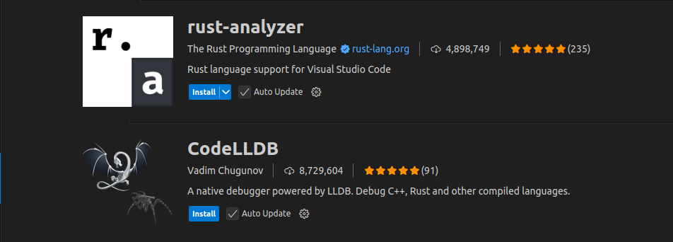
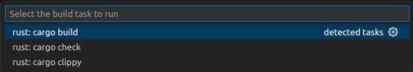
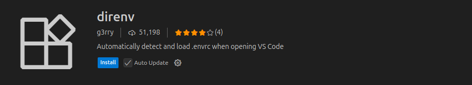
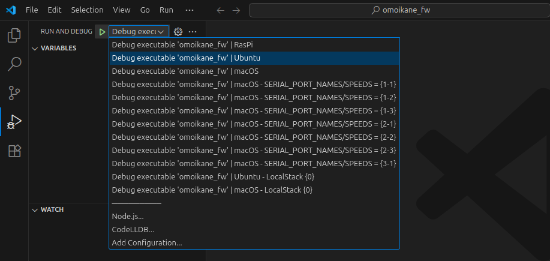
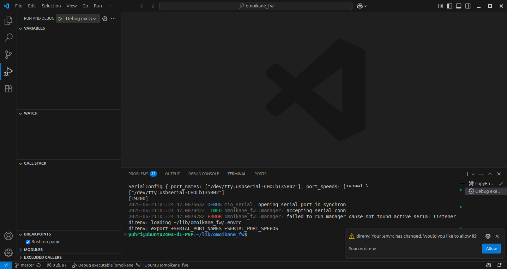

.. _chapter-installation:

============
Installation
============

About setup of USB-serial adapters, see :ref:`Setup USB-serial adapters <chapter-usbserial>`

If you want to run omoikane_fw on Windows, see :ref:`Running on WSL <chapter-windows>`

.. _section-get-source:

Source code
===========

The source code can be viewed from this `GitHub repository <https://github.com/questar-ac/omoikane_fw>`_.

Cloning the repository:

.. code-block:: bash

    git clone https://github.com/questar-ac/omoikane_fw.git

This is a private repository, so you will need your own GitHub account with access permissions as a collaborator. You also need to create a personal access token on your account to access to a private repository by ``git`` command. See this `Github Docs <https://docs.github.com/en/authentication/keeping-your-account-and-data-secure/managing-your-personal-access-tokens#creating-a-personal-access-token-classic>`_ on creating a personal access token.

To clone the private repository, you should use this command:

.. code-block:: bash

    git clone https://<your_personal_access_token>@github.com/questar-ac/omoikane_fw.git

.. _section-dependencies:

Dependencies
============

omoikane_fw requires a Rust compiler.

Requirements for omoikane_fw
^^^^^^^^^^^^^^^^^^^^^^^^^^^^

* `Redis <https://github.com/redis/redis>`_ : Redis is the preferred, fastest, and most feature-rich cache, data structure server, and document and vector query engine.

Tools required
^^^^^^^^^^^^^^

* `direnv <https://direnv.net/>`_ : direnv is an extension for your shell. It augments existing shells with a new feature that can load and unload environment variables depending on the current directory.

.. _section-prerequisites:

Prerequisites
=============

.. _section-prerequisites-linux:

Installing for Linux
^^^^^^^^^^^^^^^^^^^^

Tested for **Ubuntu 24.04**.

Install the dependencies via ``apt``.

.. code-block:: bash

    $ sudo apt update -y
    $ sudo apt upgrade -y --no-install-recommends
    # basic dependencies
    $ sudo apt install -y build-essential git curl

    # disable brltty.service
    $ sudo systemctl mask brltty-udev.service
    $ sudo systemctl stop brltty-udev.service

    # Rust compiler
    $ curl --proto '=https' --tlsv1.2 -sSf https://sh.rustup.rs | sh
    $ rustup-init
    $ cat ~/.bashrc
    ....    ....
    . "$HOME/.cargo/env"
    $ source ~/.bashrc
    $ rustc --version
    rustc 1.87.0 (17067e9ac 2025-05-09)
    $ cargo --version
    cargo 1.87.0 (99624be96 2025-05-09)

    # Redis
    $ sudo apt install -y redis-server
    $ sudo ehco "supervised systemd" >> /etc/redis/redis.conf
    $ cd /tmp
    $ git clone https://<your_personal_access_token>@github.com/questar-ac/omoikane_fw.git
    $ sudo cat /tmp/omoikane_fw/tools_config/soshinki_redis.conf >> /etc/redis/redis.conf
    $ sudo systemctl restart redis

    # direnv
    $ sudo apt install -y direnv
    $ echo 'eval "$(direnv hook bash)"' >> ~/.bashrc
    $ source ~/.bashrc

.. warning::

    Be careful not to make mis-type "``... >> ...``" as "``... > ...``"  .  If you do, the existing contents of the target files will be deleted.

Jump to :ref:`Build Instructions <section-build>` for the next step.

.. _section-prerequisites-macos:

Installing for macOS
^^^^^^^^^^^^^^^^^^^^

Tested for **macOS Ventura**.

Install the dependencies via ``brew``.

.. code-block:: bash

    brew update
    # basic dependencies
    brew install git

    # Rust compiler
    % brew install rustup-init
    % rustup-init
    % cat ~/.bashrc
    ....    ....
    . "$HOME/.cargo/env"
    % source ~/.bashrc
    % rustc --version
    rustc 1.87.0 (17067e9ac 2025-05-09)
    % cargo --version
    cargo 1.87.0 (99624be96 2025-05-09)

    # Redis
    % brew install redis
    % cd /tmp
    % git clone https://<your_personal_access_token>@github.com/questar-ac/omoikane_fw.git
    % cat /tmp/omoikane_fw/tools_config/soshinki_redis.conf >> "$(brew --prefix)"/etc/redis.conf
    % brew services start redis

    # direnv
    % brew install direnv
    % echo 'eval "$(direnv hook bash)"' >> ~/.bashrc
    % source ~/.bashrc

Jump to :ref:`Build Instructions <section-build>` for the next step.

.. _section-build:

Build Instructions
==================

.. _section-build-unix:

Building for Linux or macOS
^^^^^^^^^^^^^^^^^^^^^^^^^^^

.. code-block:: bash

    # get the omoikane_fw source
    $ mkdir -p ~/lib
    $ cd ~/lib
    $ git clone https://<your_personal_access_token>@github.com/questar-ac/omoikane_fw.git
    # build omoikane_fw
    $ cd omoikane_fw
    $ cargo build

.. _section-run:

Run Instructions
================

.. _section-run-unix:

Running for Linux
^^^^^^^^^^^^^^^^^

.. code-block:: bash

    # move to the directory of omoikane_fw source
    $ cd ~/lib/omoikane_fw
    # copy AWS IoT client certificate and key to the omoikane_fw's specific place
    $ mkdir -p ~/.aws/iot
    $ cp -R tools_config/.aws/iot ~/.aws

    # check if the USB-serial adapter is available on the system
    $ ls -l /dev/ttyUSB*
    crw-rw---- 1 root dialout 188, 0 Jun 20 09:03 /dev/ttyUSB0D
    # add your user-id to dialout group
    $ sudo usermod -a -G dialout $USER

    # Logout here

    # Login again

    # always allow direnv to load .envrc in the omoikane_fw directory
    $ mkdir -p ~/.config/direnv
    $ echo -e '[whitelist]\nprefix = [ "'$PWD'" ]' > ~/.config/direnv/direnv.toml
    $ cd ..
    $ cd omoikane_fw
    direnv: loading ~/lib/omoikane_fw/
    direnv: export +SERIAL_PORT_NAMES +SERIAL_PORT_SPEEDS
    # run the omikane_fw program
    $ cargo run

.. _section-run-macos:

Running for macOS
^^^^^^^^^^^^^^^^^

.. code-block:: bash

    # move to the directory of omoikane_fw source
    % cd ~/lib/omoikane_fw
    # copy AWS IoT client certificate and key to the omoikane_fw's specific place
    % mkdir -p ~/.aws/iot
    % cp -R tools_config/.aws/iot ~/.aws

    # check if the USB-serial adapter is available on the system
    % ls /dev/tty.*
    /dev/tty.usbserial-CHDlb135B02

    # always allow direnv to load .envrc in the omoikane_fw directory
    % mkdir -p ~/.config/direnv
    % echo -e '[whitelist]\nprefix = [ "'$PWD'" ]' > ~/.config/direnv/direnv.toml
    % cd ..
    % cd omoikane_fw
    direnv: loading ~/lib/omoikane_fw/
    direnv: export +SERIAL_PORT_NAMES +SERIAL_PORT_SPEEDS
    # run the omikane_fw program
    % cargo run

.. _subsection-build-unix-vscode:

Build Instructions for using Visual Studio Code
^^^^^^^^^^^^^^^^^^^^^^^^^^^^^^^^^^^^^^^^^^^^^^^

Building for using Visual Studio Code
-------------------------------------

1. Open Terminal and run:

.. code-block:: bash

    # get the omoikane_fw source
    $ mkdir -p ~/lib
    $ cd ~/lib
    $ git clone https://<your_personal_access_token>@github.com/questar-ac/omoikane_fw.git
    $ cd omoikane_fw

    # copy AWS IoT client certificate and key to the omoikane_fw's specific place
    $ mkdir -p ~/.aws/iot
    $ cp -R tools_config/.aws/iot ~/.aws

    # open Visual Studio Code
    $ code .

1. In Visual Studio Code:

- Install ``rust-analyzer`` and ``CodeLLDB`` extensions.

- Execute ``[Terminal]`` > ``[Run Build Task...]`` menu, then select ``[rust: cargo build]`` from the menus displayed in Command Palette.

.. _subsection-run-unix-vscode:

Run Instructions for using Visual Studio Code
---------------------------------------------

1. Open Terminal and run:

.. code-block:: bash

    # move to the directory of omoikane_fw source
    $ cd ~/lib/omoikane_fw
    # copy AWS IoT client certificate and key to the omoikane_fw's specific place
    $ mkdir -p ~/.aws/iot
    $ cp -R tools_config/.aws/iot ~/.aws

    # open Visual Studio Code
    $ code .

1. In Visual Studio Code opened:

- Install ``direnv`` extension.

.. warning::

    There are other extensions with the same name. Please find the ``direnv`` with the above icon and author.

3. In Visual Studio Code:

.. raw:: html

    

.. role:: green

- Open ``[Run and Debug]`` panel, and select ``[Debug executable 'omoikane_fw' | Ubuntu]`` from the ``[RUN AND DEBUG]`` menus.

.. NOTE::

    Please select ``[Debug executable 'omoikane_fw' | macOS]`` from the ``[RUN AND DEBUG]`` menus if you are using Visual Studio Code on macOS.

- Push [:green:`▷`] button in ``[Run and Debug]`` panel (or execute ``[Run]`` > ``[Start Debugging]`` menu).

- Push ``[Allow]`` button if the pop-up dialog below is displayed.

- Push [:green:`▷`] button again, if the program is not yet running.
