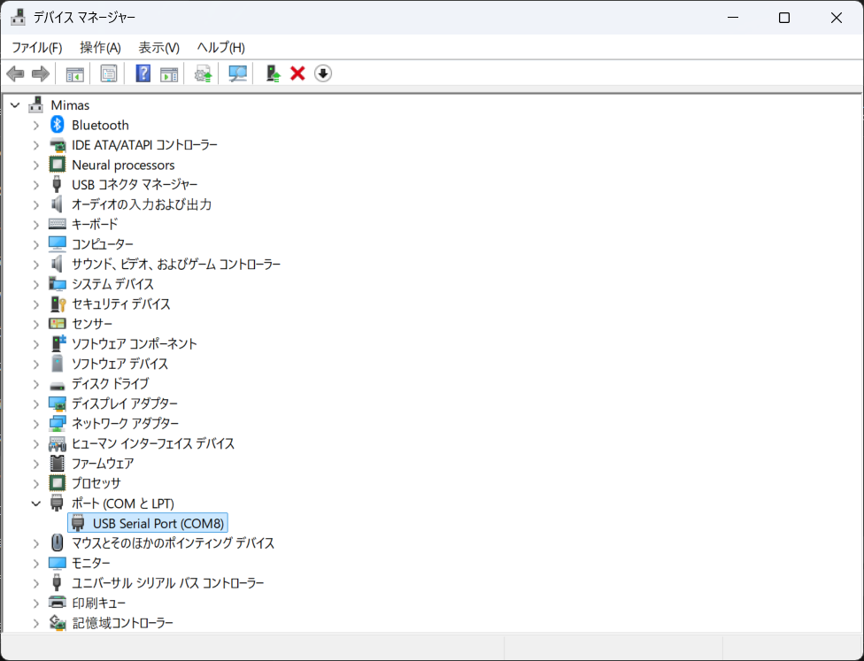
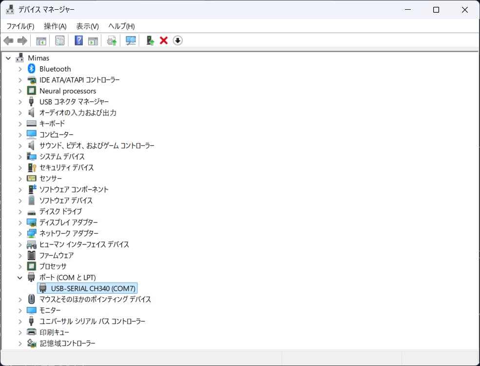
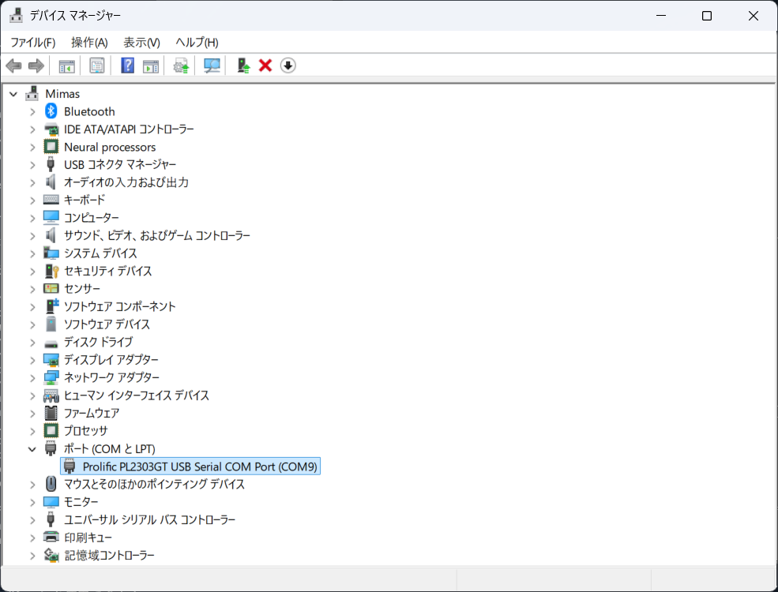
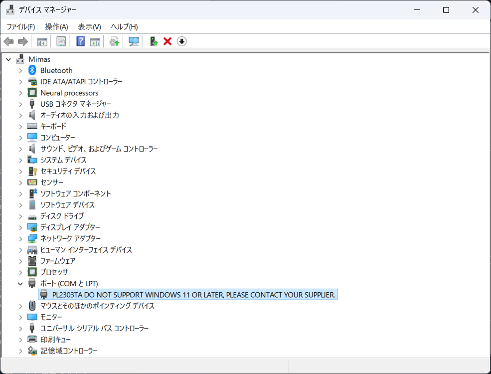
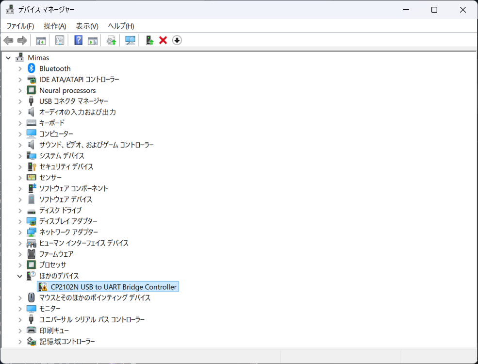

.. _chapter-usbserial:

=========================
Setup USB-serial adapters
=========================

.. _section-usbserial-linux:

Linux
=====

Drivers for USB-serial adapters from most vendors are built into the kernel.

Device files for USB-serial adapters will be ``/dev/ttyUSB*`` or ``/dev/ttyACM*``.

To see information about all USB devices, use ``lsusb`` command. If you want to see more information about all USB-serial adpaters, use "``ls -l /dev/serial/by-id``" and "``ls -l /dev/serial/by-path``" commands.

.. code-block:: bash

    $ lsusb
    Bus 002 Device 001: ID 1d6b:0003 Linux Foundation 3.0 root hub
    Bus 001 Device 003: ID 0403:6001 Future Technology Devices International, Ltd FT232 Serial (UART) IC
    Bus 001 Device 001: ID 1d6b:0002 Linux Foundation 2.0 root hub
    $ ls -l /dev/serial/by-id
    total 0
    lrwxrwxrwx 1 root root 13 Jun 17 11:23 usb-FTDI_USB_Serial_Converter_FTE3YEM3-if00-port0 -> ../../ttyUSB0
    $ ls -l /dev/serial/by-path
    total 0
    lrwxrwxrwx 1 root root 13 Jun 17 11:23 pci-000:00:1d.0-usb-0:2.3:1.0-port0 -> ../../ttyUSB0

.. _section-usbserial-macos:

macOS
=====

For macOS Mojave and later, kernel drivers for USB-serial adapters from the following vendors are built in the system.

- `FTDI <https://ftdichip.com>`_
- `WCH <https://www.wch-ic.com/>`_
- `Prolific Technology <https://www.prolific.com.tw>`_
- `Silicon Labs <https://www.silabs.com>`_
- CDC standard-compliant devices

You can check this information by using "``ls -l /System/Library/DriverExtensions/``" command.

Device files for vender specific USB-serial adapters will be ``/dev/tty.usbserial-*``. For CDC standard-compliant devices, they will be ``/dev/usbmodem*``.

.. _section-usbserial-windows:

Windows
=======

Depending on the version of Windows, some drivers for USB-serial adapters are installed automatically and others are not.

We checked for **Windows 11 24H2** and the results were as follows:

1. FTDI FT232X

2. WCH CH34X

3. Prolific Technology PL2303GT

4. Prolific Technology PL2303TA

5. Silicon Labs CP2102N

In the case 4 and 5, it is necessary to install a vendor-supplied driver to use the USB-serial adapters on Windows.

You can use `Zadig <https://zadig.akeo.ie>`_ to install a vendor-supplied driver for the USB-serial adapters that Windows does not make available automatically.